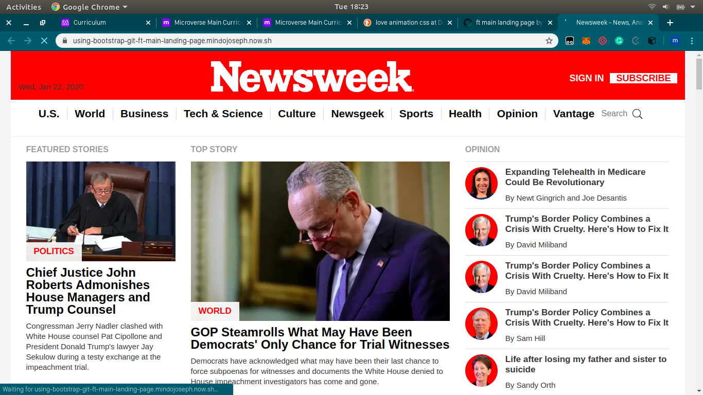

# Newsweek

### About the project

This project tests the understanding of bootstrap by implementing a responsive clone of newsweek.com

=======

## Built With

- HTML,
- CSS

## Live Demo

[Live Demo Link](https://using-bootstrap-git-ft-main-landing-page.mindojoseph.now.sh/)

👤 **Author**

- Github: [@MindoJoseph](https://github.com/Mindo-Joseph)
- Twitter: [@mindoJoseph](https://twitter.com/mindoJoseph)
- Linkedin: [Joseph Mindo](https://www.linkedin.com/in/joseph-mindo-367284132/)
- Google: mindo.joseph.mj@gmail.com

## 🤝 Contributing

Contributions, issues and feature requests are welcome!

Feel free to check the [issues page](https://github.com/Mindo-Joseph/using-bootstrap/issues).

## Show your support

Give a ⭐️ if you like this project!# using-bootstrap